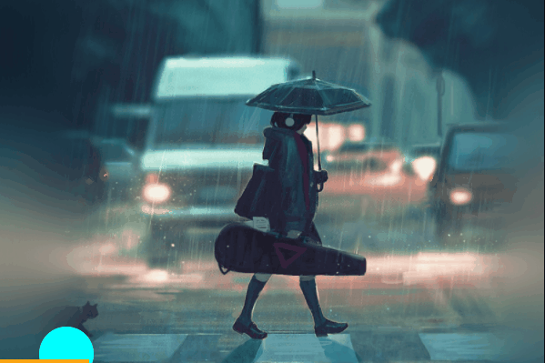
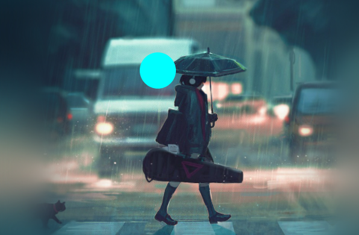

# H5 带你实现弹弹球

## 效果



## 技术铺垫

1. canvas
2. es6 
3. requestAnimationFrame

### canvas

[canvas](https://developer.mozilla.org/zh-CN/docs/Web/API/Canvas_API) 是 `web` 中的一个画布标签，可以允许我们通过js自由在上面描绘对应图形。


## es6 

案例中用了部分的es6的语法，可以参考 [阮一峰的es6](https://es6.ruanyifeng.com/)

## requestAnimationFrame

`requestAnimationFrame`，这个api需要在这里单独讲解下。

平时我们在js中想要实现动画效果，无非以下几种方式

1. 纯css手段

   1. [过渡 transition](https://developer.mozilla.org/zh-CN/docs/Web/CSS/transition)
   2. [动画 animation](https://developer.mozilla.org/zh-CN/docs/Web/CSS/animation)

2. JavaScript手段

   1. [setInterval](https://developer.mozilla.org/zh-CN/docs/Web/API/setInterval) 定时器 

      重复调用一个函数或执行一个代码段，在每次调用之间具有固定的时间延迟

   2. [setTimeout](https://developer.mozilla.org/zh-CN/docs/Web/API/setTimeout) 延时器

      **`setTimeout()`**方法设置一个定时器，该定时器在定时器到期后执行一个函数或指定的一段代码

   3. [requestAnimationFrame](https://developer.mozilla.org/zh-CN/docs/Web/API/Window/requestAnimationFrame)


### requestAnimationFrame

由于有宏任务的执行机制在，虽然我们使用了定时器  `setInterval`，但是也不可避免的会出现程序执行时间的不精确，最终会导致用户视角上的动画效果略有卡顿。

而 `requestAnimationFrame`则没有这个问题，由于一般的屏幕的刷新频率是一秒60次，那么当我们使用 `requestAnimationFrame`时，它能实现一秒执行60次的功能。因此我们使用它做动画，一般来说会更加的流畅。

> 如果我们想要执行连续动画，那么就需要在 `requestAnimationFrame`的回调函数中继续调用 它自身。


如:

```js
  let index = 0;
  function step(timestamp) {
    console.log(index);
    index++;
    window.requestAnimationFrame(step);
  }
  step();
```

> `requestAnimationFrame`  会返回一个id，用于停止自身执行

```js
let id = window.requestAnimationFrame(()=>{
  console.log(1);
});
// 被取消了
window.cancelAnimationFrame(id);
```

## 初始化项目环境

### 搭建基本标签

```html
<!DOCTYPE html>
<html lang="en">
  <head>
    <meta charset="UTF-8" />
    <meta
      name="viewport"
      content="width=device-width, initial-scale=1.0,maximum-scale=1,minimum-scale=1,user-scalable=no"
    />
    <title>index.html</title>
    <style>
      * {
        margin: 0;
        padding: 0;
        box-sizing: border-box;
      }
      body {
        padding-top: 200px;
        text-align: center;
      }
      canvas {
        border: 1px solid #000;
        background-image: url(./images/20200820014508687.jpg);
        background-size: cover;
      }
    </style>
  </head>
  <body>
    <canvas width="600" height="400"> </canvas>
  </body>
</html>
```


### 新建三个类

1. Bounce  用来实现弹跳小球
2. Baffle    用来实现底部的挡板
3. Game    用来控制小球和挡板

```js
  // 用于控制小球和挡板
  class Game {}
  // 小球
  class Bounce {}
  // 挡板
  class Baffle {}
```

## 小球



### 初始化小球

```js
class Bounce {
  constructor(ctx, option) {
    this.ctx = option.canvas.getContext('2d'); // 获取画布上下文
    this.x = option.x; // 小球的x坐标
    this.y = option.y; // 小球的y坐标
    this.speedX = option.speedX; // 水平速度
    this.speedY = option.speedY; // 垂直速度
    this.radius = option.radius; // 小球半径
    this.canvas = option.canvas; // canvas dom对象
  }
}
```

### 描绘小球

```js
class Bounce {
  show() {
    this.ctx.fillStyle = 'aqua'; // 设置小球颜色
    this.ctx.beginPath();// 重新开辟路径
    this.ctx.arc(this.x, this.y, this.radius, 0, Math.PI * 2); // 描绘圆球
    this.ctx.fill(); // 填充颜色
  }
}
```

### 设置小球自动移动

```js
class Bounce {
  move() {
    this.x += this.speedX;
    this.y += this.speedY;
    this.show();
  }
}
```

### 判断小球碰撞到边界

```js
class Bounce {
  move() {
    this.x += this.speedX;
    this.y += this.speedY;
    // 判断是否超出边界
    this.crash();
    this.show();
  }
  // 判断上下超出边界
  get overRect() {
    return this.y >= this.canvas.height || this.y <= 0;
  }
  // 小球碰到边界 设置反向移动
  crash() {
    // 判断水平超出边界
    if (this.x >= this.canvas.width || this.x <= 0) {
      // 设置相反方向
      this.speedX = -this.speedX;
    }
    // 判断上下超出边界
    if (this.overRect) {
      // 设置相反方向
      this.speedY = -this.speedY;
    }
  }
}
```

### 让小球运动起来

```js
<!DOCTYPE html>
<html lang="en">
  <head>
    <meta charset="UTF-8" />
    <meta
      name="viewport"
      content="width=device-width, initial-scale=1.0,maximum-scale=1,minimum-scale=1,user-scalable=no"
    />
    <title>index.html</title>
    <style>
      * {
        margin: 0;
        padding: 0;
        box-sizing: border-box;
      }
      body {
        padding-top: 200px;
        text-align: center;
      }
      canvas {
        border: 1px solid #000;
        background-image: url(./images/20200820014508687.jpg);
        background-size: cover;
      }
    </style>
  </head>
  <body>
    <canvas width="600" height="400"> </canvas>
    <script>
      // 小球
      class Bounce {
        constructor(ctx, option) {
          this.ctx = ctx;
          this.x = option.x;
          this.y = option.y;
          this.speedX = option.speedX;
          this.speedY = option.speedY;
          this.radius = option.radius;
          this.canvas = option.canvas;
        }
        move() {
          // 清除旧的 clearRect(x,y,宽度，高度)
          this.ctx.clearRect(0, 0, this.canvas.width, this.canvas.height);
          this.x += this.speedX;
          this.y += this.speedY;
          this.crash();
          this.show();
        }
        // 超出边界
        get overRect() {
          return this.y >= this.canvas.height || this.y <= 0;
        }
        crash() {
          if (this.x >= this.canvas.width || this.x <= 0) {
            this.speedX = -this.speedX;
          }
          // 圆心碰到上下
          if (this.overRect) {
            this.speedY = -this.speedY;
          }
        }
        show() {
          this.ctx.fillStyle = 'aqua';
          this.ctx.beginPath();
          this.ctx.arc(this.x, this.y, this.radius, 0, Math.PI * 2);
          this.ctx.fill();
        }
      }

      const canvas = document.querySelector('canvas'); // 获取canvas标签
      const ctx = canvas.getContext('2d'); // 获取画布上下文

      // 创建小球
      const bounce = new Bounce(ctx, {
        x: parseInt(Math.random() * canvas.width - 50), // 随机的x
        y: 0,
        speedX: 3,
        speedY: 3,
        radius: 30,
        canvas,
      });

      // 暂时用定时器代替
      setInterval(() => {
        bounce.move();
      }, 16);
    </script>
  </body>
</html>

```


## 挡板


### 初始化挡板

```js
class Baffle {
  constructor(ctx, option) {
    this.ctx = ctx;//  画布上下文
    this.canvas = option.canvas; //  画布dom元素
    this.x = option.x; // 挡板x坐标
    this.y = option.y; // 挡板y坐标
    this.width = option.width; // 挡板的宽度
    this.height = option.height; // 挡板的高度
    this.color = option.color; // 挡板的颜色
  }
}
```

### 描绘挡板

```js
class Baffle {
  show() {
    const fillStyle = this.ctx.fillStyle; // 先缓存当前画布颜色
    this.ctx.fillStyle = this.color; // 设置画布颜色
    this.ctx.fillRect(this.x, this.y, this.width, this.height); // 描绘矩形 - 挡板
    this.ctx.fillStyle = fillStyle; // 重新设置画布颜色
  }
}
```

### 添加键盘控制事件

```js
class Baffle {
    // 通过键盘控制挡板移动
  controlMove() {
    // canvas不支持绑定键盘事件
    document.body.addEventListener('keydown', (e) => {
      switch (e.key) {
        case 'ArrowLeft':
          this.x -= 30;
          // 如果挡板超出左边界
          if (this.x < 0) {
            this.x = 0;
          }
          break;
        case 'ArrowRight':
          this.x += 30;
          // 如果挡板超出右边界
          if (this.x + this.width > this.canvas.width) {
            this.x = this.canvas.width - this.width;
          }
          break;
        default:
          break;
      }
    });
  }
}
```

### 渲染挡板

```js
// 挡板
class Baffle {
  constructor(ctx, option) {
    this.ctx = ctx;
    this.canvas = option.canvas;
    this.x = option.x;
    this.y = option.y;
    this.width = option.width;
    this.height = option.height;
    this.color = option.color;

    // 添加键盘事件
    this.controlMove();
  }
  show() {
    console.log(this.x, this.y);
    const fillStyle = this.ctx.fillStyle;
    this.ctx.fillStyle = this.color;
    this.ctx.fillRect(this.x, this.y, this.width, this.height);
    this.ctx.fillStyle = fillStyle;
  }
  controlMove() {
    // canvas不支持绑定键盘事件
    document.body.addEventListener('keydown', (e) => {
      switch (e.key) {
        case 'ArrowLeft':
          this.x -= 30;
          if (this.x < 0) {
            this.x = 0;
          }
          break;
        case 'ArrowRight':
          this.x += 30;
          if (this.x + this.width > this.canvas.width) {
            this.x = this.canvas.width - this.width;
            console.log(this.x);
          }
          break;
        default:
          break;
      }
    });
  }
}

const canvas = document.querySelector("canvas");
const ctx = canvas.getContext('2d');
this.baffle = new Baffle(ctx, {
  x: 0,
  y: canvas.height - 4,
  width: 100,
  height: 4,
  canvas,
  color: 'orange',
});

// 暂时使用定时器
setInterval(() => {
  ctx.clearRect(0, 0, canvas.width, canvas.height);
  this.baffle.show();
}, 16);
```


## 优化

由于，要考虑到添加 一个game类 来统一控制 小球和挡板，那么我们需要先对小球和挡板的代码进行封装和优化。

### 完整的小球代码

```js
class Bounce {
  // 初始化
  constructor(ctx, option) {
    this.ctx = ctx;
    this.x = option.x;
    this.y = option.y;
    this.speedX = option.speedX;
    this.speedY = option.speedY;
    this.radius = option.radius;
    this.canvas = option.canvas;
  }
  // 设置小球移动
  move() {
    this.x += this.speedX;
    this.y += this.speedY;
    this.crash();
    this.show();
  }

  // 判断是否到了底部
  get isReachBottom() {
    return this.y >= this.canvas.height;
  }
  // 超出边界
  get overRect() {
    return this.y >= this.canvas.height || this.y <= 0;
  }
  // 处理碰撞 调整方向
  crash() {
    if (this.x >= this.canvas.width || this.x <= 0) {
      this.speedX = -this.speedX;
    }
    // 圆心碰到上下
    if (this.overRect) {
      this.speedY = -this.speedY;
    }
  }
  // 描绘小球
  show() {
    this.ctx.fillStyle = 'aqua';
    this.ctx.beginPath();
    this.ctx.arc(this.x, this.y, this.radius, 0, Math.PI * 2);
    this.ctx.fill();
  }
}
```

### 完整的挡板的代码

```js
// 挡板
class Baffle {
  // 初始化
  constructor(ctx, option) {
    this.ctx = ctx;
    this.canvas = option.canvas;
    this.x = option.x;
    this.y = option.y;
    this.width = option.width;
    this.height = option.height;
    this.color = option.color;

    // 添加键盘控制事件
    this.controlMove();
  }
  // 描绘挡板
  show() {
    const fillStyle = this.ctx.fillStyle;
    this.ctx.fillStyle = this.color;
    this.ctx.fillRect(this.x, this.y, this.width, this.height);
    this.ctx.fillStyle = fillStyle;
  }
  // 添加键盘控制事件
  controlMove() {
    // canvas不支持绑定键盘事件
    document.body.addEventListener('keydown', (e) => {
      switch (e.key) {
        case 'ArrowLeft':
          this.x -= 30;
          if (this.x < 0) {
            this.x = 0;
          }
          break;
        case 'ArrowRight':
          this.x += 30;
          if (this.x + this.width > this.canvas.width) {
            this.x = this.canvas.width - this.width;
          }
          break;
        default:
          break;
      }
    });
  }
}
```


## game 类

### 搭建game类结构

```js

// 游戏类
class Game {
  // 构造函数 
  constructor(el, option) {

  }
  // 负责初始化
  init(el, option) {

  }
  // 清空画布
  clear() {
  }
  // 添加要持续播放的动画
  addInanimationList() {
    this.animationList.push(this.clear.bind(this));

  }
  // 启动
  start() {
    this.requestAnimationFrame();
  }
  // 负责开启动画
  requestAnimationFrame() {

  }

  // 判断小球和挡板是否碰撞
  get isCrashBaffle() {

  }
}

```

### 完整game代码

```js

class Game {
    // 构造函数 
  constructor(el, option) {
    this.init(el, option);
    this.start();
  }
     // 负责初始化
  init(el, option) {
    const canvas = document.querySelector(el);// 获取画布dom
    canvas.width = option.width; // 设置宽度
    canvas.height = option.height; // 设置高度
    const ctx = canvas.getContext('2d'); // 获取画布上下文
    this.canvas = canvas; 
    this.ctx = ctx;
      // 创建小球
    this.bounce = new Bounce(ctx, {
      x: parseInt(Math.random() * canvas.width - 50),
      y: 0,
      speedX: 3,
      speedY: 3,
      radius: 30,
      canvas,
    });
      // 创建挡板
    this.baffle = new Baffle(ctx, {
      x: 0,
      y: canvas.height - 4,
      width: 100,
      height: 4,
      canvas,
      color: 'orange',
    });
    this.animationList = []; // 存放要持续执行的动画
    this.addInanimationList(); // 统计添加要持续播放的动画
  }
     // 清空画布
  clear() {
    this.ctx.clearRect(0, 0, this.canvas.width, this.canvas.height);
  }
    // 添加要持续播放的动画
  addInanimationList() {
    this.animationList.push(this.clear.bind(this));
    this.animationList.push(this.bounce.move.bind(this.bounce));
    this.animationList.push(this.baffle.show.bind(this.baffle));
    // 判断碰撞
  }
    // 启动
  start() {
    this.requestAnimationFrame();
  }
    // 负责开启动画
  requestAnimationFrame() {
      // 小球 如果没有碰到挡板 并且 碰到了地板
    if (!this.isCrashBaffle && this.bounce.isReachBottom) {
      alert("你输了");
      location.reload();
    } else {
      this.animationList.forEach((fn) => fn());
      this.requestAnimationFrameId = window.requestAnimationFrame(() => {
        this.requestAnimationFrame();
      });
    }
  }
  // 判断小球和挡板是否碰撞
  get isCrashBaffle() {
    const isBetweenX =
      this.bounce.x + this.bounce.radius >= this.baffle.x &&
      this.bounce.x <= this.baffle.x + this.baffle.width;
    const isBetweenY =
      this.bounce.y + this.bounce.radius >= this.baffle.y;
    return isBetweenX && isBetweenY;
  }
}
```


## 案例完整代码

```js
<!DOCTYPE html>
<html lang="en">
  <head>
    <meta charset="UTF-8" />
    <meta
      name="viewport"
      content="width=device-width, initial-scale=1.0,maximum-scale=1,minimum-scale=1,user-scalable=no"
    />
    <title>index.html</title>
    <style>
      * {
        margin: 0;
        padding: 0;
        box-sizing: border-box;
      }
      body {
        padding-top: 200px;
        text-align: center;
      }
      canvas {
        border: 1px solid #000;
        background-image: url(./images/20200820014508687.jpg);
        background-size: cover;
      }
    </style>
  </head>
  <body>
    <canvas width="600" height="400"> </canvas>
    <script>
      class Game {
        constructor(el, option) {
          this.init(el, option);
          this.start();
        }
        init(el, option) {
          const canvas = document.querySelector(el);
          canvas.width = option.width;
          canvas.height = option.height;
          const ctx = canvas.getContext('2d');
          this.canvas = canvas;
          this.ctx = ctx;
          this.bounce = new Bounce(ctx, {
            x: parseInt(Math.random() * canvas.width - 50),
            y: 0,
            speedX: 3,
            speedY: 3,
            radius: 30,
            canvas,
          });
          this.baffle = new Baffle(ctx, {
            x: 0,
            y: canvas.height - 4,
            width: 100,
            height: 4,
            canvas,
            color: 'orange',
          });
          this.requestAnimationFrameId = undefined;
          this.animationList = [];
          this.addInanimationList();
        }
        clear() {
          this.ctx.clearRect(0, 0, this.canvas.width, this.canvas.height);
        }
        addInanimationList() {
          this.animationList.push(this.clear.bind(this));
          this.animationList.push(this.bounce.move.bind(this.bounce));
          this.animationList.push(this.baffle.show.bind(this.baffle));
          // 判断碰撞
        }
        start() {
          this.requestAnimationFrame();
        }
        requestAnimationFrame() {
          if (!this.isCrashBaffle && this.bounce.isReachBottom) {
            alert('你输了');
            location.reload();
          } else {
            this.animationList.forEach((fn) => fn());
            this.requestAnimationFrameId = window.requestAnimationFrame(() => {
              this.requestAnimationFrame();
            });
          }
        }

        get isCrashBaffle() {
          const isBetweenX =
            this.bounce.x + this.bounce.radius >= this.baffle.x &&
            this.bounce.x <= this.baffle.x + this.baffle.width;
          const isBetweenY =
            this.bounce.y + this.bounce.radius >= this.baffle.y;

          return isBetweenX && isBetweenY;
        }
      }
      // 小球
      class Bounce {
        constructor(ctx, option) {
          this.ctx = ctx;
          this.x = option.x;
          this.y = option.y;
          this.speedX = option.speedX;
          this.speedY = option.speedY;
          this.radius = option.radius;
          this.canvas = option.canvas;
        }
        move() {
          this.x += this.speedX;
          this.y += this.speedY;
          this.crash();
          this.show();
        }

        get isReachBottom() {
          return this.y >= this.canvas.height;
        }
        // 超出边界
        get overRect() {
          return this.y >= this.canvas.height || this.y <= 0;
        }
        crash() {
          if (this.x >= this.canvas.width || this.x <= 0) {
            this.speedX = -this.speedX;
          }
          // 圆心碰到上下
          if (this.overRect) {
            this.speedY = -this.speedY;
          }
        }
        show() {
          this.ctx.fillStyle = 'aqua';
          this.ctx.beginPath();
          this.ctx.arc(this.x, this.y, this.radius, 0, Math.PI * 2);
          this.ctx.fill();
        }
      }

      // 挡板
      class Baffle {
        constructor(ctx, option) {
          this.ctx = ctx;
          this.canvas = option.canvas;
          this.x = option.x;
          this.y = option.y;
          this.width = option.width;
          this.height = option.height;
          this.color = option.color;

          this.controlMove();
        }
        show() {
          const fillStyle = this.ctx.fillStyle;
          this.ctx.fillStyle = this.color;
          this.ctx.fillRect(this.x, this.y, this.width, this.height);
          this.ctx.fillStyle = fillStyle;
        }
        controlMove() {
          // canvas不支持绑定键盘事件
          document.body.addEventListener('keydown', (e) => {
            switch (e.key) {
              case 'ArrowLeft':
                this.x -= 30;
                if (this.x < 0) {
                  this.x = 0;
                }
                break;
              case 'ArrowRight':
                this.x += 30;
                if (this.x + this.width > this.canvas.width) {
                  this.x = this.canvas.width - this.width;
                }
                break;
              default:
                break;
            }
          });
        }
      }
      const game = new Game('canvas', { width: 600, height: 400 });
    </script>
  </body>
</html>

```


## 其他

1. [10分钟-带你走进H5-五子棋](https://juejin.cn/post/7074568084459094046)
2. [canvas生成海报](https://juejin.cn/post/6844903955219103758)
3. [代码地址](https://github.com/itcastWsy/bounce) 